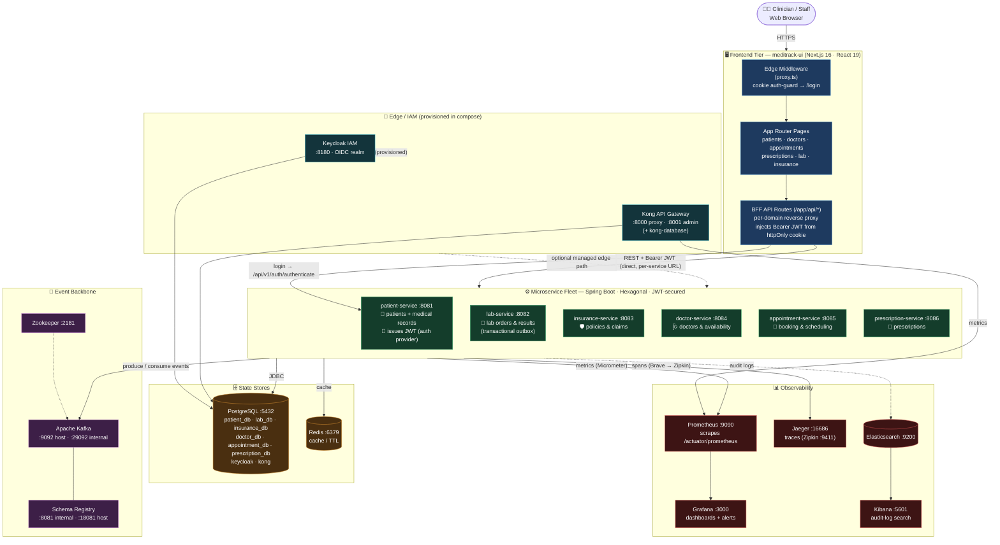
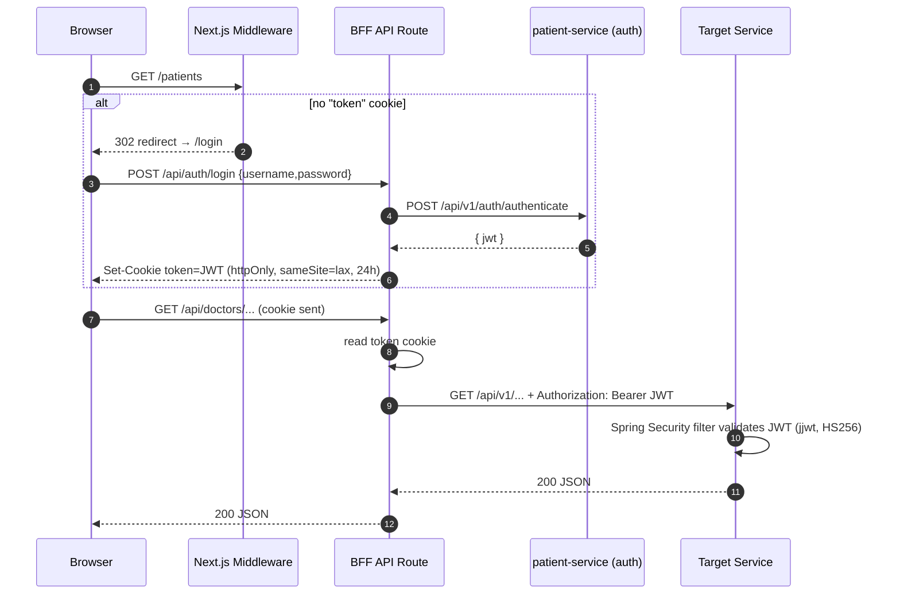
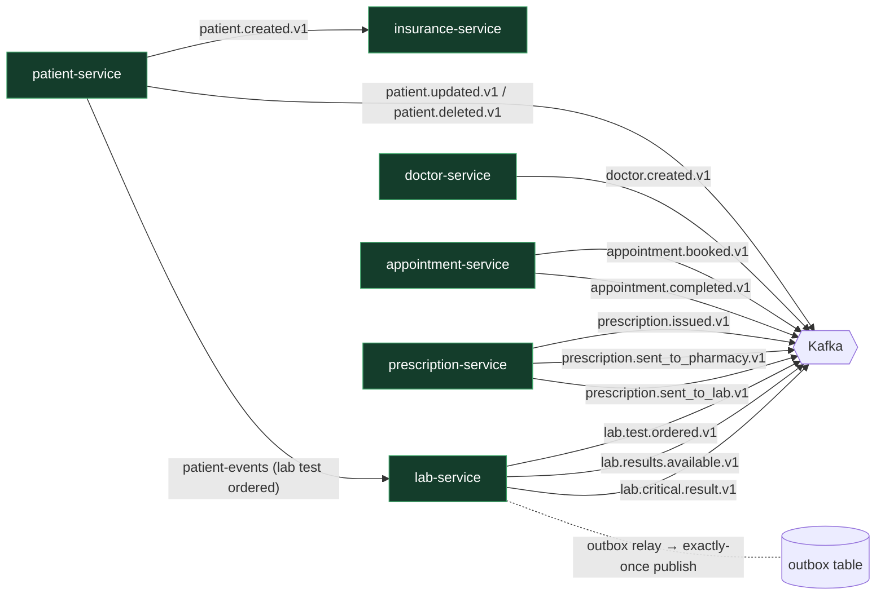
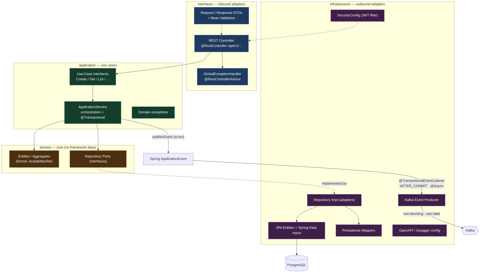
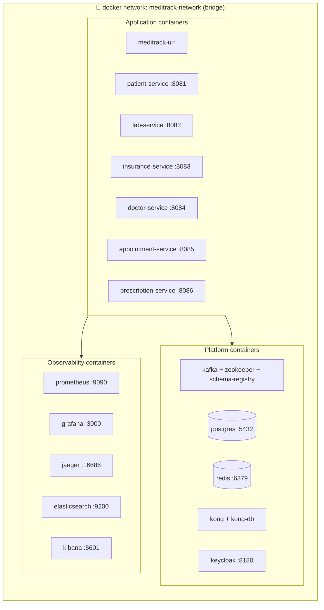
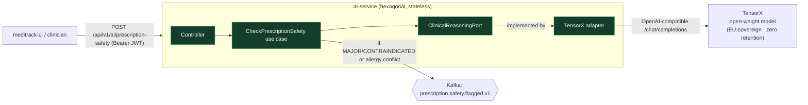

# MediTrack — System Architecture

> A HIPAA-minded, event-driven hospital management platform built as a Spring Boot
> microservice fleet behind a Next.js BFF, with a full observability + identity stack.
>
> **Stack:** Java 21 · Spring Boot 3.2.4 · PostgreSQL 15 · Redis 7 · Kafka 7.5 (Confluent) ·
> Next.js 16 / React 19 · Kong · Keycloak · Prometheus · Grafana · Jaeger · Elasticsearch + Kibana.
>
> All diagrams below are [Mermaid](https://mermaid.js.org/) and render natively on GitHub.

---

## 1. High-Level System Architecture (C4 Container view)

> **Note on the edge tier:** Kong + Keycloak are fully provisioned in `docker-compose.yml`, but
> the current `meditrack-ui` BFF calls each service **directly** via per-service env URLs
> (`DOCTOR_SERVICE_URL`, `PATIENT_SERVICE_URL`, …) and uses **patient-service** as the JWT issuer
> (`POST /api/v1/auth/authenticate`). The gateway/IdP path is the intended production edge and is
> drawn with dashed lines to reflect "provisioned, not yet on the hot path."

---

## 2. Authentication & Request Flow

**Security properties**
- JWT secret shared across services via `JWT_SECRET` env (HS256, 24h expiry).
- Token stored **httpOnly** — not reachable by browser JS (XSS-resistant).
- Each Spring service runs a stateless `SecurityFilterChain` (`SessionCreationPolicy.STATELESS`, CSRF disabled).
- `/actuator/**`, `/swagger-ui/**`, `/v3/api-docs/**` are public for ops & docs.

---

## 3. Event-Driven Choreography (Kafka topics)

Services are loosely coupled through domain events. Producers never call consumers directly.

### Topic catalog

| Topic | Producer | Consumer(s) | Pattern |
|---|---|---|---|
| `patient.created.v1` | patient-service | insurance-service | direct publish |
| `patient.updated.v1` | patient-service | — | direct publish |
| `patient.deleted.v1` | patient-service | — | direct publish |
| `patient-events` (lab test ordered) | patient-service | lab-service | direct publish |
| `lab.test.ordered.v1` | lab-service | — | **transactional outbox** (`OutboxRelay`) |
| `lab.results.available.v1` | lab-service | — | event publisher |
| `lab.critical.result.v1` | lab-service | — | event publisher |
| `doctor.created.v1` | doctor-service | — | **post-commit async** (`@TransactionalEventListener` AFTER_COMMIT, non-fatal) |
| `appointment.booked.v1` | appointment-service | — | direct publish |
| `appointment.completed.v1` | appointment-service | — | direct publish |
| `prescription.issued.v1` | prescription-service | — | direct publish |
| `prescription.sent_to_pharmacy.v1` | prescription-service | — | direct publish |
| `prescription.sent_to_lab.v1` | prescription-service | — | direct publish |
| `prescription.safety.flagged.v1` | **ai-service** | (pharmacy · notification · audit) | best-effort produce (non-fatal) |

> **Reliability spectrum (strongest → weakest):**
> - `lab-service` — **transactional outbox**: events written to a DB outbox table inside the business
>   transaction and relayed to Kafka by a separate poller (`OutboxRelay`). At-least-once, no dual-write loss.
> - `doctor-service` — **post-commit async publish**: the use case emits a Spring `ApplicationEvent`;
>   a `@TransactionalEventListener(AFTER_COMMIT)` + `@Async` handler sends to Kafka with a low
>   `max.block.ms` and swallows delivery errors. A broker outage **no longer blocks or rolls back**
>   doctor creation (graceful degradation, at-most-once). *(Hardened — see fixes below.)*
> - `patient` / `appointment` / `prescription` — still publish **inline** via `KafkaTemplate.send(...)`
>   inside their `@Transactional` methods, so a broker outage will fail (and roll back) the originating
>   request. **Recommended next step:** roll out the doctor-service pattern (or the outbox) to these three.

---

## 4. Per-Service Internal Architecture (Hexagonal / Clean)

Every service shares the same layered, ports-and-adapters layout. `doctor-service` shown as the template.

**Cross-cutting per service:** Flyway DB migrations · Spring Boot Actuator · Micrometer +
Brave tracing → Jaeger · Prometheus registry · Redis cache · springdoc OpenAPI UI.

---

## 5. Deployment Topology (docker-compose)

\* `meditrack-ui` runs as a Next.js app (dev/standalone); the six services build from per-service
`Dockerfile`s and start with `SPRING_PROFILES_ACTIVE=docker` (Postgres + internal Kafka listener
`kafka:29092`). Named volumes persist Postgres, Redis, Kafka, Grafana, Prometheus, Elasticsearch.

---

## 6. Quick Reference

### Service ports & datastores
| Service | Port | Database | Role |
|---|---|---|---|
| meditrack-ui (Next.js BFF) | 3001 | — | UI + reverse proxy + auth cookie |
| patient-service | 8081 | `patient_db` | patients, medical records, **JWT auth issuer** |
| lab-service (labrotary) | 8082 | `lab_db` | lab orders/results, **outbox** |
| insurance-service | 8083 | `insurance_db` | policies, claims (consumes patient events) |
| doctor-service | 8084 | `doctor_db` | doctors, availability slots |
| appointment-service | 8085 | `appointment_db` | appointment booking |
| prescription-service | 8086 | `prescription_db` | prescriptions |
| ai-service | 8089 | — (stateless) | clinical decision support via TensorX open-weight inference |

The UI now runs on `:3001` (`next dev -p 3001`) so it no longer collides with Grafana's host `:3000`.

### Platform & ops endpoints
| Component | Port(s) | Purpose |
|---|---|---|
| Kong | 8000 / 8443 proxy · 8001 / 8444 admin | API gateway (provisioned) |
| Keycloak | 8180 | OIDC identity provider (provisioned) |
| Kafka | 9092 (host) · 29092 (internal) | event backbone |
| Zookeeper | 2181 | Kafka coordination |
| Schema Registry | 18081 host · 8081 internal | Avro/JSON schema governance (remapped off patient-service's 8081) |
| PostgreSQL | 5432 | primary state store (per-service DBs) |
| Redis | 6379 | cache |
| Prometheus | 9090 | metrics scraping (`/actuator/prometheus`) |
| Grafana | 3000 | dashboards + alert rules |
| Jaeger | 16686 (UI) · 9411 (Zipkin ingest) | distributed tracing |
| Elasticsearch / Kibana | 9200 / 5601 | audit-log storage & search |

### Architectural patterns in play
- **Microservices** with database-per-service isolation.
- **Hexagonal / Clean Architecture** (interfaces → application → domain → infrastructure).
- **Event-driven choreography** over Kafka with versioned topics (`*.v1`).
- **Transactional Outbox** (lab-service) for reliable publish.
- **Backend-for-Frontend (BFF)** in Next.js, with httpOnly-cookie JWT session.
- **Observability triad**: metrics (Prometheus/Grafana), tracing (Micrometer→Jaeger), logs (ELK).
- **API Gateway + IdP** (Kong + Keycloak) provisioned for a managed edge.
- **Graceful degradation** of event publishing (doctor-service): write path stays available when
  Kafka is down.
- **AI clinical decision support** (ai-service): open-weight LLM inference behind a domain port,
  screening prescriptions for drug interactions and allergy conflicts.

---

## 6b. AI / Clinical Decision Support (ai-service :8089)

The first AI capability is a **prescription safety screen**: given a proposed prescription plus the
patient's current medications and documented allergies, `ai-service` returns a structured assessment
of **drug–drug interactions** and **allergy conflicts** with per-finding severity
(`NONE → MINOR → MODERATE → MAJOR → CONTRAINDICATED`) and a recommended action.

**Design choices**
- **Provider behind a port.** `ClinicalReasoningPort` is the domain abstraction; `TensorXClinicalReasoningAdapter`
  is one implementation. Swapping inference vendors (or dropping in a rules engine) never touches the domain.
- **TensorX for PHI-grade inference.** OpenAI-compatible API, **EU-sovereign hosting, zero data retention** —
  a defensible posture for clinical data versus a US LLM SaaS. Model is env-configurable
  (`TENSORX_MODEL`, default `deepseek/deepseek-chat-v3.1`); temperature pinned low (0.1) for repeatable, conservative output.
- **Stateless — no PHI at rest.** The service persists nothing; the request carries the full clinical
  picture and the response is returned and (if flagged) announced on the backbone.
- **Fail safe, not silent.** Missing key / upstream failure / unparseable reply → **502**, never a false
  all-clear. Unknown severity labels default to `MODERATE`; every response is stamped with an explicit
  *advisory-only, verify-with-a-pharmacist* disclaimer.

> **Roadmap (same service + client):** lab-result explainer, SOAP-note generation, and patient-history
> summary are follow-on use cases on the same `ClinicalReasoningPort`.

---

## 7. Fixes Applied (this pass)

Issues discovered while running and testing `doctor-service`, and the remediations made:

| # | Issue discovered | Severity | Fix |
|---|---|---|---|
| 1 | Entity↔schema column mismatch — `DoctorEntity.active`/`AvailabilitySlotEntity.available` mapped to `ACTIVE`/`AVAILABLE` but Flyway defines `is_active`/`is_available`. **Every read query threw 500.** | 🔴 Critical | Added `@Column(name = "is_active")` / `@Column(name = "is_available")`. |
| 2 | `createDoctor` published to Kafka **inline inside `@Transactional`**. With the broker down it **blocked 60s, returned 500, and rolled back** — creation was impossible without Kafka. | 🔴 Critical | Publish via Spring `ApplicationEvent` → `@TransactionalEventListener(AFTER_COMMIT)` + `@Async`, non-fatal callback, `max.block.ms=5000`. Create now returns **201 in ~0.4s** with Kafka down. |
| 3 | Bean-validation failures returned **500** instead of 400 (no `MethodArgumentNotValidException` handler). | 🟠 High | Added handlers for `MethodArgumentNotValidException` (400 + field errors) and `HttpMessageNotReadableException` (400 for bad JSON / invalid enum). |
| 4 | Host port collision: `patient-service` and `schema-registry` both bound host `:8081`. | 🟡 Medium | Remapped schema-registry to host `:18081` (internal stays `:8081`). |
| 5 | Host port collision: UI dev server (`:3000`) vs Grafana (`:3000`). | 🟡 Medium | UI scripts pinned to `:3001`; Grafana keeps the conventional `:3000`. |

**Verified after fixes (Kafka intentionally down):** list/get/filter `200`, create `201` (~0.4s, persisted),
duplicate `409`, not-found `404`, set-schedule + get-slots `200`, missing-field & bad-enum `400`.

**Not yet addressed (recommended):** apply fix #2's pattern (or the outbox) to `patient`,
`appointment`, and `prescription` services, which still publish inline inside their transactions.

---
*Generated from the live repository surface: `docker-compose.yml`, per-service Spring code,
`monitoring/`, and `meditrack-ui/`. Dashed lines = provisioned-but-not-yet-on-hot-path.*
