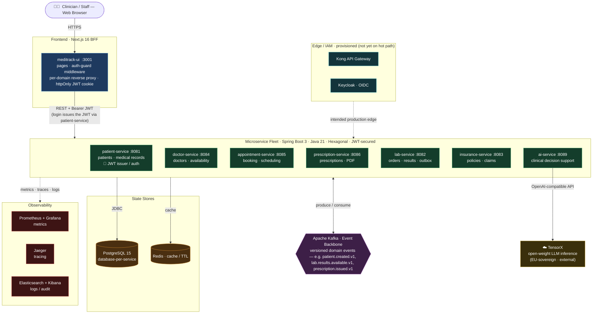

# MediTrack - Healthcare Data Exchange Platform

[](https://spring.io/projects/spring-boot)
[](https://www.oracle.com/java/)
[](https://kafka.apache.org/)
[](https://www.postgresql.org/)
[](https://nextjs.org/)

MediTrack is an event-driven hospital management platform. Seven Spring Boot microservices —
**patients, doctors, appointments, prescriptions, lab, insurance**, and an **AI clinical-decision-support**
service — each own their data and coordinate through versioned Kafka domain events rather than direct
calls. A **Next.js backend-for-frontend (BFF)** is the single edge the browser talks to, and the whole
platform is wrapped in a metrics/traces/logs observability stack.

## 📋 Table of Contents

- [Overview](#overview)
- [Architecture](#architecture)
- [Prerequisites](#prerequisites)
- [Quick Start](#quick-start)
- [Local Development](#local-development)
- [Docker Deployment](#docker-deployment)
- [Service Ports](#service-ports)
- [API Documentation](#api-documentation)
- [Monitoring & Observability](#monitoring--observability)
- [Database Schema](#database-schema)
- [Testing](#testing)
- [Project Structure](#project-structure)

## 🎯 Overview

### The Problem We Solve

Healthcare data is fragmented across multiple systems (hospital EMRs, lab systems, insurance databases, pharmacy systems), leading to:
- Manual, error-prone data entry
- Delayed care decisions
- Poor patient experience
- Inconsistent information

### Our Solution

MediTrack connects the clinical domains of a hospital in real-time using:
- **Event-Driven Choreography**: inter-service communication via versioned Kafka events (`*.v1`) — producers never call consumers directly
- **Database-per-Service**: each service owns its own PostgreSQL database; no service reads another's tables
- **Hexagonal Architecture**: clean separation of business logic (domain) from framework/IO concerns (adapters)
- **Backend-for-Frontend (BFF)**: a Next.js edge holds the session as an httpOnly-cookie JWT and reverse-proxies each request
- **Transactional Outbox**: reliable, no-dual-write event publishing (lab-service)
- **AI Clinical Decision Support**: drug-interaction / allergy screening and lab-result explanation via open-weight LLM inference
- **CQRS** (patient-service): separate command/query services for reads and writes

## 🏗️ Architecture

### System Architecture

> Single view of the whole platform. Solid arrows are the live request/data path;
> dashed arrows are provisioned-but-not-yet-on-the-hot-path (edge) or cross-cutting
> telemetry. Renders natively on GitHub.



### Technology Stack

| Layer | Technology | Purpose |
|-------|-----------|---------|
| **Language / Framework** | Java 21 · Spring Boot 3.2.4 | Microservices foundation |
| **Frontend / BFF** | Next.js 16 · React 19 | UI + reverse-proxy edge + auth cookie |
| **Event Streaming** | Apache Kafka (Confluent Platform 7.5) | Event backbone |
| **Schema Registry** | Confluent 7.5 | Event schema evolution |
| **Database** | PostgreSQL 15 | Transactional data (database-per-service) |
| **Migrations** | Flyway | Versioned schema migrations |
| **Caching** | Redis 7.2 | Query cache / TTL |
| **AI Inference** | TensorX (open-weight LLM) | Clinical decision support |
| **Authentication** | Keycloak 23 (provisioned) · JWT (jjwt, HS256) | Identity & access management |
| **API Gateway** | Kong 3.4 (provisioned) | Centralized API management |
| **Metrics** | Micrometer → Prometheus / Grafana | Metrics & dashboards |
| **Tracing** | Micrometer Tracing + Brave → Jaeger 1.50 | Distributed tracing |
| **Logging** | Elasticsearch + Kibana | Log search / audit trail |

## 📦 Prerequisites

### Required Software

- **Java 21** (all services) & **Maven 3.9+**
- **Node.js 20+** (for `meditrack-ui`)
- **Docker 24+** & **Docker Compose**
- **Git**

### Memory note

The full stack is ~20 containers (7 JVMs + Kafka + Postgres + observability + edge) and needs roughly
**7–8 GB** of Docker memory. On a constrained machine, use the **lean stack** (`docker-compose.min.yml`)
described under [Quick Start](#-quick-start) instead of running everything at once.

## 🚀 Quick Start

### 0. Configure environment

```bash
git clone <repository-url>
cd MediTrack

# Create your .env from the template and fill in the secrets
cp .env.example .env
# Required: POSTGRES_*, REDIS_PASSWORD, JWT_SECRET (openssl rand -hex 32),
# and TENSORX_API_KEY (for ai-service — it fails safe with HTTP 502 without one).
```

### Option 1: Full stack (Docker Compose)

```bash
# Start everything (~20 containers, needs ~7–8 GB Docker memory)
docker-compose up -d

# Check status / logs
docker-compose ps
docker-compose logs -f patient-service
```

### Option 2: Lean stack (constrained machines — recommended for local dev)

`docker-compose.min.yml` runs only auth + the AI service on minimal infra, and inherits every
service definition from the main compose file via `extends`.

```bash
# Base lean stack: postgres, kafka, zookeeper, redis, patient-service, ai-service (~3–4 GB)
docker compose -f docker-compose.min.yml up -d

# Opt into the full clinical loop (adds doctor, appointment, prescription):
docker compose -f docker-compose.min.yml --profile clinical up -d

# Tear down (match the profile on down)
docker compose -f docker-compose.min.yml --profile clinical down
```

### The UI

```bash
cd meditrack-ui
npm install
npm run dev          # http://localhost:3001  (log in as admin / admin123)
```

## 💻 Local Development

### Running Individual Services

Every service runs the same way. The default profile uses in-memory **H2**; the `docker` profile uses
PostgreSQL + the internal Kafka listener.

```bash
cd services/<service>          # patient-service · labrotary-service · insurance-service ·
                               # doctor-service · appointment-service · prescription-service · ai-service
./mvnw spring-boot:run

# With the docker profile (Postgres + kafka:29092)
./mvnw spring-boot:run -Dspring-boot.run.profiles=docker
```

> **ai-service** needs `TENSORX_API_KEY` in the environment (it holds no database and is stateless).
> The UI (`meditrack-ui`) is a Next.js app — run it with `npm run dev` (see Quick Start).

### Database Access

**H2 Console (Local Development):**
- Patient Service: http://localhost:8081/h2-console
- Lab Service: http://localhost:8082/h2-console
- Insurance Service: http://localhost:8083/h2-console

**PostgreSQL (Docker):**
```bash
# Connect to PostgreSQL
docker exec -it meditrack-postgres psql -U meditrack -d patient_db

# List all databases
\l

# Connect to specific database
\c lab_db

# List tables
\dt
```

### Kafka Operations

Topics are auto-created and **versioned** (`patient.created.v1`, `lab.results.available.v1`,
`prescription.issued.v1`, `prescription.safety.flagged.v1`, …). The lab-order handoff to lab-service
uses the `patient-events` topic.

```bash
# List topics (via the running Kafka container — no local Kafka needed)
docker exec meditrack-kafka kafka-topics --bootstrap-server localhost:9092 --list

# Consume a topic from the beginning
docker exec meditrack-kafka kafka-console-consumer \
  --bootstrap-server localhost:9092 --topic patient-events --from-beginning --timeout-ms 8000

docker exec meditrack-kafka kafka-console-consumer \
  --bootstrap-server localhost:9092 --topic prescription.safety.flagged.v1 --from-beginning --timeout-ms 8000
```

## 🐳 Docker Deployment

### Build Service Images

```bash
# Build all services
docker-compose build

# Build specific service
docker-compose build patient-service
```

### Start Complete Stack

```bash
# Start everything
docker-compose up -d

# Start only infrastructure
docker-compose up -d postgres redis kafka zookeeper

# Start specific services
docker-compose up -d patient-service lab-service
```

## 🔌 Service Ports

| Service | Port | Purpose |
|---------|------|---------|
| **meditrack-ui (BFF)** | 3001 | Next.js UI + reverse proxy + auth cookie |
| **Patient Service** | 8081 | Patients, medical records, **JWT issuer** |
| **Laboratory Service** | 8082 | Lab orders & results (outbox) |
| **Insurance Service** | 8083 | Insurance & claims API |
| **Doctor Service** | 8084 | Doctors & availability |
| **Appointment Service** | 8085 | Booking & scheduling |
| **Prescription Service** | 8086 | Prescriptions & PDF |
| **AI Service** | 8089 | Clinical decision support (TensorX) |
| **PostgreSQL** | 5432 | Database (per-service DBs) |
| **Redis** | 6379 | Cache |
| **Kafka** | 9092 (host) / 29092 (internal) | Event broker |
| **Schema Registry** | 18081 (host) / 8081 (internal) | Event schemas |
| **Kong API Gateway** | 8000 proxy / 8001 admin | API gateway (provisioned) |
| **Keycloak** | 8180 | Identity provider (provisioned) |
| **Prometheus** | 9090 | Metrics |
| **Grafana** | 3000 | Dashboards |
| **Jaeger UI** | 16686 | Distributed tracing |
| **Elasticsearch / Kibana** | 9200 / 5601 | Log search & audit |

## 📚 API Documentation

### Patient Service

```bash
# Authenticate (get a JWT) — seeded dev users: admin/admin123, doctor/doctor123,
# nurse/nurse123, labtech/labtech123
POST http://localhost:8081/api/v1/auth/authenticate
Content-Type: application/json

{ "username": "admin", "password": "admin123" }

# Create patient (all requests below need: Authorization: Bearer <JWT>)
POST http://localhost:8081/api/v1/patients
Content-Type: application/json

{
  "mrn": "MRN-001",
  "ssn": "123-45-6789",
  "firstName": "John",
  "lastName": "Doe",
  "dateOfBirth": "1980-01-15",
  "email": "john.doe@example.com",
  "phoneNumber": "555-1234"
}

# Get patient by ID   ·   Search: GET /api/v1/patients/search?query=Doe
GET http://localhost:8081/api/v1/patients/{id}

# Order a lab test for a patient (routed by SSN)
POST http://localhost:8081/api/v1/patients/{ssn}/order-labs
Content-Type: application/json

{ "testCode": "CBC", "priority": "ROUTINE", "doctorId": "DR-1", "notes": "annual" }
```

### Laboratory Service

```bash
# Create lab order (Authorization: Bearer <JWT>)
POST http://localhost:8082/api/v1/lab/orders
Content-Type: application/json

{
  "patientId": "patient-uuid",
  "mrn": "MRN-001",
  "facilityId": "F1",
  "orderingPhysicianId": "DR-1",
  "orderingProviderName": "Dr House",
  "priority": "ROUTINE",
  "tests": [{"testCode": "CBC", "testName": "Complete Blood Count"}]
}

# Submit a result   ·   Critical results: GET /api/v1/lab/results/critical
POST http://localhost:8082/api/v1/lab/results
Content-Type: application/json

{
  "orderId": "order-uuid",
  "testCode": "CBC",
  "resultValue": "18.5",
  "resultUnit": "x10^9/L",
  "referenceRange": "4-11",
  "abnormalFlag": "CRITICALLY_HIGH",
  "performedBy": "tech1"
}
```

### AI Service — Clinical Decision Support

Powered by [TensorX](https://tensorx.ai) open-weight models (EU-sovereign, OpenAI-compatible,
zero data retention). Set `TENSORX_API_KEY` in `.env` before use — the service fails safe (HTTP 502)
without it. Stateless: no PHI is persisted.

```bash
# Screen a prescription for drug-drug interactions and allergy conflicts
POST http://localhost:8089/api/v1/ai/prescription-safety
Authorization: Bearer <JWT>
Content-Type: application/json

{
  "medications": [
    {"name": "Warfarin", "dosage": "5mg", "route": "oral"},
    {"name": "Ibuprofen", "dosage": "400mg", "route": "oral"}
  ],
  "currentMedications": ["Aspirin 81mg"],
  "knownAllergies": ["penicillin"],
  "patientAgeYears": 68,
  "patientSex": "MALE"
}

# → 200: { overallRisk, requiresPharmacistReview, interactions[], allergyConflicts[], recommendation, disclaimer, ... }
# A MAJOR/CONTRAINDICATED or allergy-conflict result also emits prescription.safety.flagged.v1 on Kafka.
```

```bash
# Explain a panel of lab results in plain language
POST http://localhost:8089/api/v1/ai/lab-result-explanation
Authorization: Bearer <JWT>
Content-Type: application/json

{
  "results": [
    {"testName": "Potassium", "value": "6.4", "unit": "mmol/L", "referenceRange": "3.5-5.1", "flag": "CRITICAL"},
    {"testName": "Hemoglobin", "value": "8.1", "unit": "g/dL", "referenceRange": "13.5-17.5", "flag": "L"}
  ],
  "patientAgeYears": 64,
  "patientSex": "MALE"
}

# → 200: { urgency (ROUTINE..CRITICAL), overallSummary, patientFriendlySummary, results[], suggestedFollowUp, disclaimer }
```

### Actuator Endpoints

All services expose Spring Boot Actuator endpoints:

```bash
# Health check
GET http://localhost:8081/actuator/health

# Prometheus metrics
GET http://localhost:8081/actuator/prometheus
```

## 📊 Monitoring & Observability

### Grafana Dashboards

Access Grafana at **http://localhost:3000** (credentials from your `.env`: `GRAFANA_ADMIN_USER` / `GRAFANA_ADMIN_PASSWORD`)

Pre-configured dashboards:
- **MediTrack Platform Overview**: Service health, request rates, response times
- **JVM Metrics**: Memory usage, GC activity, thread pools

### Prometheus

Access Prometheus at **http://localhost:9090**

Key metrics:
- `http_server_requests_seconds`: Request latency
- `jvm_memory_used_bytes`: JVM memory usage
- `kafka_consumer_lag`: Event processing lag

### Jaeger Tracing

Access Jaeger UI at **http://localhost:16686**

Track request flows across services with distributed tracing.

## 🗄️ Database Schema

### Patient Service Schema

- `patients`: Core patient demographics
- `patient_addresses`: Multiple addresses per patient
- `patient_insurance`: Insurance policies
- `medical_records`: Comprehensive medical history
- `patient_timeline`: Unified care timeline
- `lab_orders`: Lab test orders

### Laboratory Service Schema

- `lab_orders`: Test orders
- `lab_tests`: Individual tests with results
- `specimens`: Physical specimens
- `reference_ranges`: Normal value ranges
- `test_catalog`: Available tests

### Insurance Service Schema

- `insurance_policies`: Patient policies
- `payers`: Insurance companies
- `pre_authorizations`: Pre-auth requests
- `insurance_claims`: Claims

## 🧪 Testing

### Run Unit Tests

```bash
# Any service — tests run against in-memory H2
cd services/<service>
./mvnw test

# A specific test class
./mvnw test -Dtest=PatientControllerTest
```

> **Note:** repository/persistence tests currently mock the JPA layer, so they run without a real
> database. Integration tests against a real PostgreSQL (e.g. Testcontainers) are a known gap on the
> roadmap — see [ARCHITECTURE.md](ARCHITECTURE.md).

## 📁 Project Structure

```
MediTrack/
├── services/
│   ├── patient-service/          # Patients, medical records, JWT auth issuer
│   ├── labrotary-service/        # Laboratory (orders, results, transactional outbox)
│   ├── insurance-service/        # Insurance policies & claims
│   ├── doctor-service/           # Doctors & availability slots
│   ├── appointment-service/      # Appointment booking & scheduling
│   ├── prescription-service/     # Prescriptions & PDF generation
│   └── ai-service/               # AI clinical decision support (TensorX)
├── meditrack-ui/                 # Next.js 16 BFF + web UI
├── infrastructure/
│   └── postgres/init-scripts/    # Per-service database initialization
├── monitoring/
│   ├── prometheus/               # Prometheus config & alert rules
│   └── grafana/                  # Grafana dashboards
├── docker-compose.yml            # Full stack (~20 containers)
├── docker-compose.min.yml        # Lean stack + opt-in `clinical` profile
├── ARCHITECTURE.md               # Detailed architecture & diagrams
├── .env.example                  # Environment template
└── README.md                     # This file
```

---

**Built with ❤️ for better healthcare interoperability**