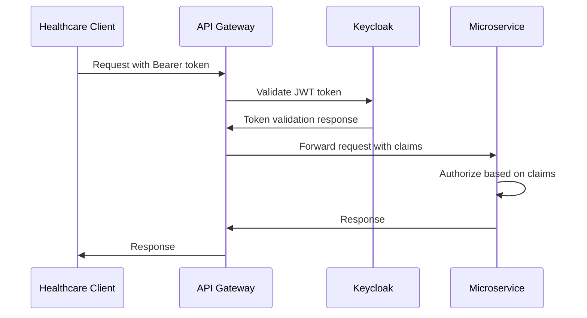

# MediTrack - Technical Specification Document

## Executive Summary

MediTrack is an event-driven microservices platform that solves healthcare data fragmentation by creating a real-time data exchange hub. The system enables seamless interoperability between hospitals, laboratories, insurance providers, and pharmacies through Apache Kafka-powered event streaming.

## 1. System Architecture Overview

### 1.1 Architectural Patterns
- **Event-Driven Architecture**: All inter-service communication via Kafka events
- **Hexagonal Architecture**: Clean separation of business logic from external concerns
- **Domain-Driven Design**: Service boundaries aligned with healthcare business domains
- **CQRS Pattern**: Separate read/write models for optimal performance
- **Event Sourcing**: Complete audit trail for regulatory compliance

### 1.2 Technology Stack Matrix

| Layer | Technology | Version | Purpose |
|-------|-----------|---------|---------|
| **Application** | Spring Boot | 3.2 | Microservices framework |
| **Event Streaming** | Apache Kafka | 3.6 | Event backbone |
| **Schema Management** | Confluent Schema Registry | 7.5 | Event schema evolution |
| **Database** | PostgreSQL | 15 | Transactional data |
| **Caching** | Redis | 7.2 | Session & query cache |
| **Authentication** | Keycloak | 23 | Identity & access management |
| **API Gateway** | Kong | 3.4 | Centralized API management |
| **Container** | Docker | 24 | Application containerization |
| **Orchestration** | Kubernetes | 1.28 | Container orchestration |
| **Monitoring** | Prometheus/Grafana | Latest | Metrics & visualization |
| **Tracing** | Jaeger | 1.50 | Distributed tracing |

## 2. Microservices Architecture

### 2.1 Service Boundaries & Responsibilities

#### 2.1.1 Patient Service
```yaml
Domain: Patient Management
Responsibility: Patient demographics, medical records, care coordination
Database: PostgreSQL (patient_db)
Cache: Redis (patient_cache)
Events Published:
  - patient.created.v1
  - patient.updated.v1
  - patient.discharged.v1
Events Consumed:
  - lab.results.available.v1
  - prescription.filled.v1
```

**Core Entities:**
- Patient (Aggregate Root)
- MedicalRecord
- ContactInformation
- InsuranceDetails

**API Endpoints:**
- `POST /api/v1/patients` - Create patient
- `GET /api/v1/patients/{id}` - Get patient details
- `PUT /api/v1/patients/{id}` - Update patient
- `GET /api/v1/patients/{id}/timeline` - Healthcare timeline

#### 2.1.2 Laboratory Service
```yaml
Domain: Laboratory Operations
Responsibility: Test orders, results processing, equipment integration
Database: PostgreSQL (lab_db)
Cache: Redis (lab_cache)
Events Published:
  - lab.test.ordered.v1
  - lab.results.available.v1
  - lab.test.cancelled.v1
Events Consumed:
  - patient.created.v1
  - insurance.preauth.approved.v1
```

**Core Entities:**
- LabOrder (Aggregate Root)
- TestResult
- LabEquipment
- ReferenceRange

**Integration Points:**
- HL7 MLLP for lab equipment
- FHIR R4 for external systems
- LIS (Laboratory Information System) adapters

#### 2.1.3 Insurance Service
```yaml
Domain: Insurance & Claims
Responsibility: Eligibility verification, claims processing, pre-authorization
Database: PostgreSQL (insurance_db)
Cache: Redis (insurance_cache)
Events Published:
  - insurance.eligibility.verified.v1
  - insurance.claim.processed.v1
  - insurance.preauth.approved.v1
Events Consumed:
  - patient.created.v1
  - lab.test.ordered.v1
  - prescription.created.v1
```

**Core Entities:**
- InsurancePolicy (Aggregate Root)
- Claim
- PreAuthorization
- Copayment

**External Integrations:**
- X12 EDI for payer communication
- Real-time eligibility APIs
- Claims clearinghouses

#### 2.1.4 Pharmacy Service
```yaml
Domain: Prescription Management
Responsibility: Prescription processing, drug interactions, inventory
Database: PostgreSQL (pharmacy_db)
Cache: Redis (pharmacy_cache)
Events Published:
  - prescription.received.v1
  - prescription.filled.v1
  - medication.dispensed.v1
Events Consumed:
  - patient.created.v1
  - insurance.preauth.approved.v1
```

**Core Entities:**
- Prescription (Aggregate Root)
- Medication
- DrugInteraction
- Inventory

**External Integrations:**
- NCPDP SCRIPT for e-prescribing
- Drug database APIs (First Databank, Lexicomp)
- POS system integration

### 2.2 Cross-Cutting Services

#### 2.2.1 Notification Service
```yaml
Purpose: Real-time notifications and alerts
Technologies: Spring Boot, WebSocket, FCM
Events Consumed: All domain events
Delivery Channels:
  - Push notifications
  - SMS via Twilio
  - Email via SendGrid
  - In-app notifications
```

#### 2.2.2 Audit Service
```yaml
Purpose: HIPAA compliance and regulatory audit trails
Technologies: Spring Boot, Elasticsearch
Events Consumed: All domain events + system events
Storage: Long-term archival in S3
Retention: 7 years (regulatory requirement)
```

## 3. Event Streaming Architecture

### 3.1 Kafka Topic Design

| Topic Name | Partitions | Replication | Retention | Purpose |
|------------|------------|-------------|-----------|---------|
| `patient-events` | 12 | 3 | 30 days | Patient lifecycle events |
| `lab-events` | 8 | 3 | 90 days | Laboratory test events |
| `insurance-events` | 6 | 3 | 365 days | Insurance/claims events |
| `pharmacy-events` | 8 | 3 | 90 days | Prescription events |
| `audit-events` | 4 | 3 | 7 years | Compliance audit trail |
| `notification-events` | 4 | 3 | 7 days | Real-time notifications |

### 3.2 Event Schema Evolution Strategy

```json
{
  "namespace": "com.meditrack.events",
  "type": "record",
  "name": "PatientCreated",
  "version": "1.0",
  "fields": [
    {"name": "eventId", "type": "string"},
    {"name": "timestamp", "type": "long", "logicalType": "timestamp-millis"},
    {"name": "patientId", "type": "string"},
    {"name": "demographics", "type": {
      "type": "record",
      "name": "Demographics",
      "fields": [
        {"name": "firstName", "type": "string"},
        {"name": "lastName", "type": "string"},
        {"name": "dateOfBirth", "type": "string"},
        {"name": "ssn", "type": ["null", "string"], "default": null},
        {"name": "mrn", "type": "string"}
      ]
    }}
  ]
}
```

**Schema Evolution Rules:**
- Backward compatibility maintained for 2 major versions
- Field additions: Always optional with defaults
- Field deletions: Deprecated for 6 months before removal
- Type changes: Use union types for transitions

### 3.3 Kafka Streams Processing

#### Real-time Patient Care Coordination
```java
@StreamProcessor
public class PatientCareCoordinator {
    
    @StreamListener("patient-events")
    @SendTo("care-coordination-events")
    public KStream<String, CareEvent> coordinateCare(
            KStream<String, PatientEvent> patientEvents) {
        
        return patientEvents
            .filter((key, event) -> event.getType() == EventType.PATIENT_ADMITTED)
            .mapValues(this::createCareCoordinationPlan)
            .through("care-coordination-topic");
    }
}
```

#### Insurance Pre-authorization Workflow
```java
@StreamProcessor
public class PreAuthProcessor {
    
    public KStream<String, PreAuthResult> processPreAuth(
            KStream<String, LabOrderEvent> labOrders,
            KTable<String, InsurancePolicy> policies) {
        
        return labOrders
            .join(policies, (order, policy) -> 
                preAuthService.checkAuthorization(order, policy))
            .mapValues(this::determineAuthorizationStatus);
    }
}
```

## 4. Data Architecture

### 4.1 Database Design Strategy

#### Multi-tenant Data Isolation
```sql
-- Patient Service Schema
CREATE SCHEMA patient_tenant_001;
CREATE TABLE patient_tenant_001.patients (
    patient_id UUID PRIMARY KEY,
    tenant_id VARCHAR(50) NOT NULL,
    mrn VARCHAR(20) UNIQUE NOT NULL,
    first_name VARCHAR(100) NOT NULL,
    last_name VARCHAR(100) NOT NULL,
    date_of_birth DATE NOT NULL,
    created_at TIMESTAMP WITH TIME ZONE DEFAULT NOW(),
    updated_at TIMESTAMP WITH TIME ZONE DEFAULT NOW()
);

-- Row Level Security
ALTER TABLE patient_tenant_001.patients ENABLE ROW LEVEL SECURITY;
CREATE POLICY tenant_isolation ON patient_tenant_001.patients
    FOR ALL TO application_role
    USING (tenant_id = current_setting('app.current_tenant'));
```

### 4.2 Caching Strategy

#### Redis Cache Patterns
```yaml
Cache Layers:
  L1 - Application Cache:
    - Type: Caffeine (in-memory)
    - TTL: 5 minutes
    - Size: 1000 entries per service
    
  L2 - Distributed Cache:
    - Type: Redis Cluster
    - TTL: 1 hour (frequent queries), 24 hours (static data)
    - Eviction: LRU
    
  L3 - Database Query Cache:
    - Type: PostgreSQL shared_buffers
    - Size: 25% of available memory
```

#### Cache Invalidation Strategy
```java
@EventHandler
public class CacheInvalidationHandler {
    
    @KafkaListener(topics = "patient-events")
    public void handlePatientUpdate(PatientUpdatedEvent event) {
        // Invalidate patient-specific caches
        cacheManager.evict("patient-details", event.getPatientId());
        cacheManager.evict("patient-timeline", event.getPatientId());
        
        // Invalidate related caches
        cacheManager.evictPattern("patient-search:*");
    }
}
```

## 5. Security Architecture

### 5.1 Authentication & Authorization

#### OAuth2/OIDC Flow


#### Role-Based Access Control
```yaml
Healthcare Roles:
  - HEALTHCARE_ADMIN: Full system access
  - DOCTOR: Patient data, prescriptions, lab orders
  - NURSE: Patient care, limited medical records
  - LAB_TECHNICIAN: Lab orders, results entry
  - PHARMACIST: Prescriptions, drug interactions
  - INSURANCE_AGENT: Claims, eligibility verification
  - PATIENT: Own medical records, appointments

Permission Matrix:
  Patient Data:
    - READ: DOCTOR, NURSE, PATIENT (own)
    - WRITE: DOCTOR, NURSE
    - DELETE: HEALTHCARE_ADMIN only
  
  Lab Results:
    - READ: DOCTOR, NURSE, LAB_TECHNICIAN, PATIENT (own)
    - WRITE: LAB_TECHNICIAN
    - DELETE: LAB_TECHNICIAN (within 24h)
```

### 5.2 Data Encryption

#### Encryption at Rest
```yaml
Database Encryption:
  - PostgreSQL: Transparent Data Encryption (TDE)
  - Redis: RDB and AOF encryption
  - Kafka: Topic-level encryption with KMS
  
Field-Level Encryption:
  - PII Data: AES-256 with customer-managed keys
  - Medical Records: AES-256 with HSM-backed keys
  - Financial Data: Tokenization + encryption
```

#### Encryption in Transit
```yaml
Internal Communication:
  - Service-to-Service: mTLS with certificate rotation
  - Database Connections: SSL/TLS 1.3
  - Kafka: SASL_SSL with SCRAM-SHA-512
  
External Communication:
  - Client APIs: TLS 1.3 with HSTS
  - Third-party APIs: TLS 1.3 + API key authentication
```

### 5.3 HIPAA Compliance Framework

#### Technical Safeguards
```yaml
Access Control:
  - Unique user identification
  - Automatic logoff after 15 minutes
  - Role-based access controls
  
Audit Controls:
  - All data access logged
  - Failed login attempts tracked
  - System changes audited
  
Data Integrity:
  - Checksums for data transmission
  - Digital signatures for critical transactions
  - Immutable audit logs
  
Transmission Security:
  - End-to-end encryption
  - VPN for internal communications
  - Secure APIs with rate limiting
```

## 6. Monitoring & Observability

### 6.1 Metrics Collection

#### Application Metrics
```yaml
Business Metrics:
  - Patient registrations per hour
  - Lab test turnaround time
  - Insurance approval rate
  - Prescription fill rate
  
Technical Metrics:
  - API response times (p50, p95, p99)
  - Database connection pool usage
  - Kafka consumer lag
  - Cache hit/miss ratios
  
Infrastructure Metrics:
  - CPU and memory utilization
  - Database performance
  - Network I/O
  - Storage utilization
```

#### Custom Prometheus